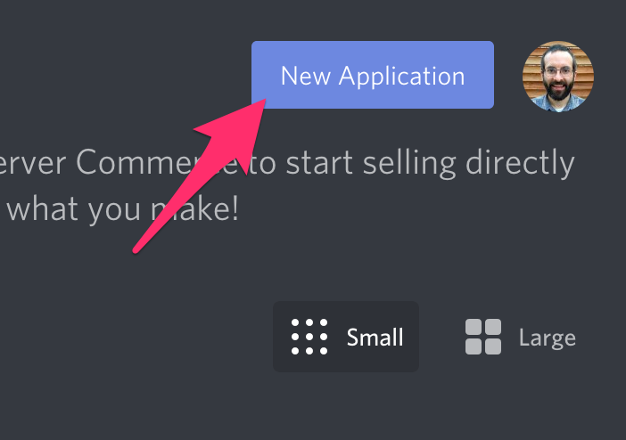
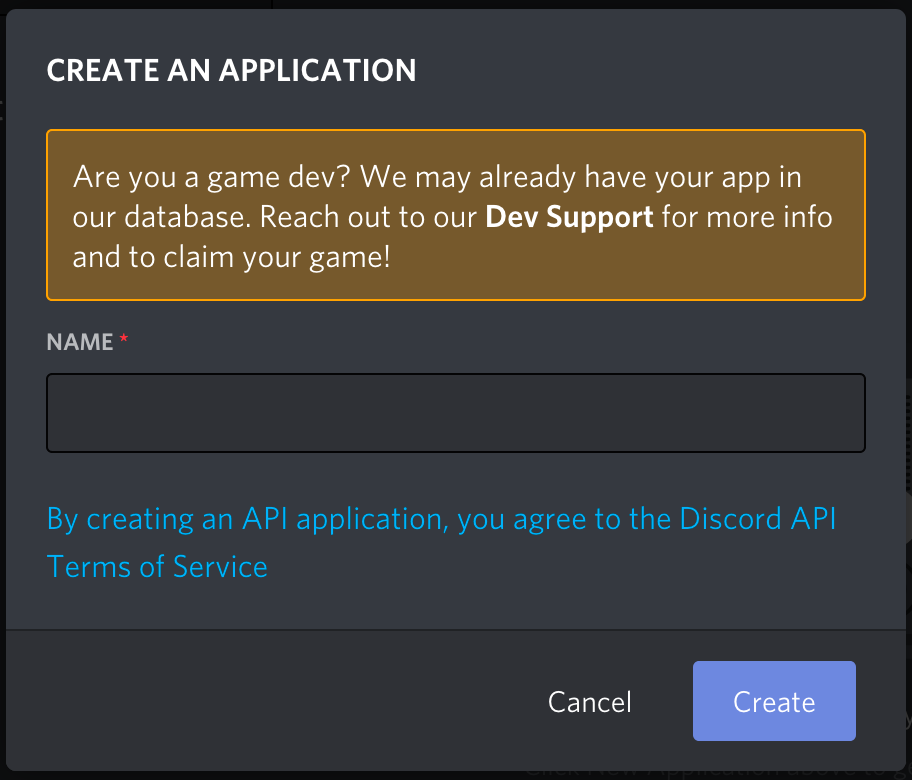
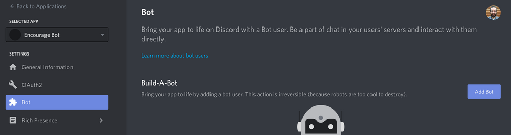
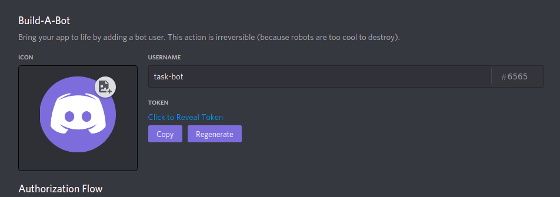
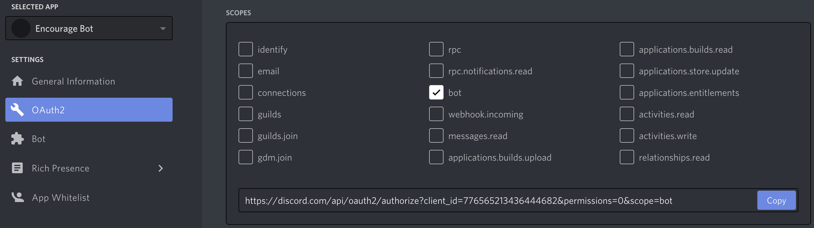
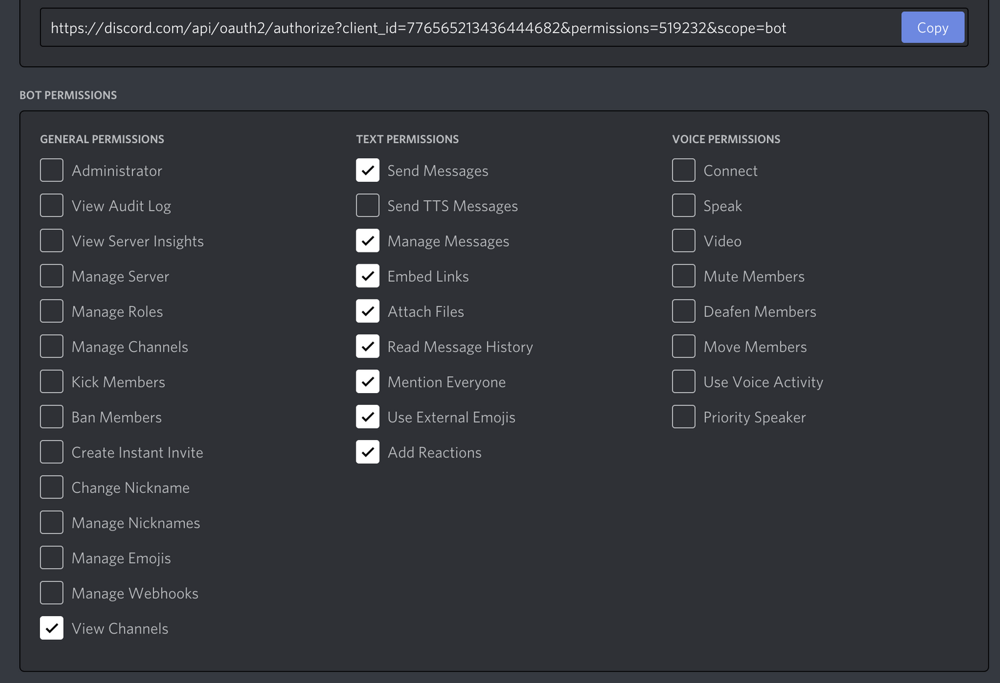
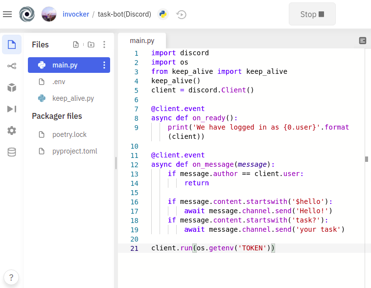
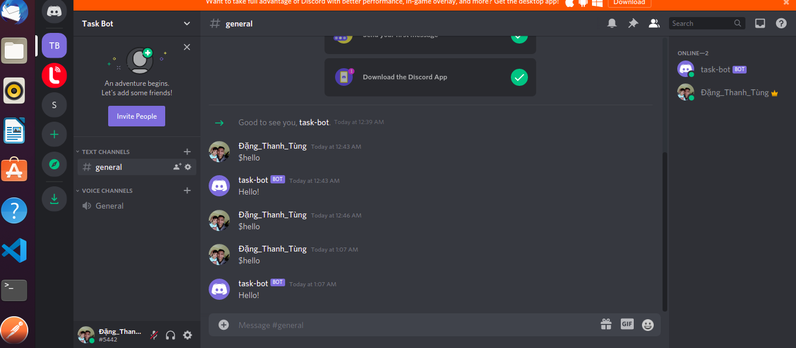
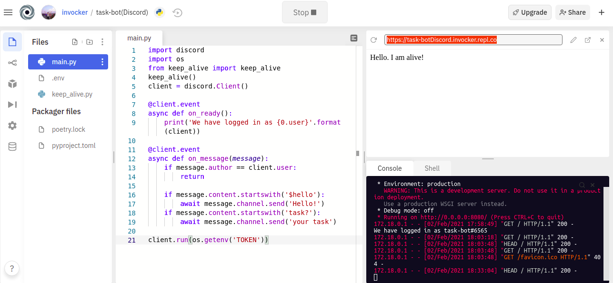
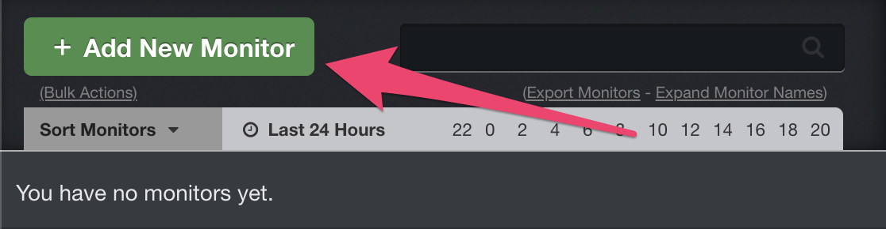

# Tạo chat bot discord bằng python - Full Tutorial

- Bạn không cần cài đặt bất kỳ thứ gì trên máy tính của mình và bạn không cần phải trả bất kỳ khoản phí nào để lưu trữ bot của mình.

- Tôi sẽ sử dụng một số công cụ, bao gồm API Discord, thư viện Python và nền tảng điện toán đám mây có tên Repl.it.

### Làm sao để tạo một bot discord nhỉ?

- Để làm việc với thư viện Python và API Discord, trước tiên chúng ta phải tạo một tài khoản Discord Bot.

- Đây là bước tạo tài khoản Discord Bot.

1. Đảm bảo rằng bạn đã đăng nhập vào trang web Discord.

2. Điều hướng đến trang ứng dụng.

3. Nhấp vào nút “New Application”.



4. Đặt tên cho ứng dụng và nhấp vào “Create”.




5. Chuyển đến tab “Bot” và sau đó nhấp vào “Add Bot”. Bạn sẽ phải xác nhận bằng cách nhấp vào "Yes, do it!"



Bot của bạn đã được tạo. Bước tiếp theo là sao chép mã thông báo.(Click copy bên cạnh avatar của bot)



- mã thông báo này là mật khẩu bot của bạn, vì vậy đừng chia sẻ nó với bất kỳ ai.
- Nó có thể cho phép ai đó đăng nhập vào bot của bạn và làm đủ mọi trò xấu.

- Bạn có thể tạo lại mã thông báo nếu nó vô tình được chia sẻ.

### Cách thêm Bot của bạn vào máy chủ
- Bây giờ bạn phải đưa Bot của mình vào một máy chủ. Để làm điều này, bạn nên tạo một URL mời cho nó.

Chuyển đến tab "OAuth2". Sau đó chọn "bot" trong phần "scopes".



- Bây giờ hãy chọn các quyền bạn muốn cho bot.
- Bot của chúng tôi sẽ chủ yếu sử dụng tin nhắn văn bản nên chúng tôi không cần nhiều quyền.
- Bạn có thể cần nhiều hơn tùy thuộc vào những gì bạn muốn bot của mình làm.
- Hãy cẩn thận với quyền "Administrator".




- Sau khi chọn các quyền thích hợp, hãy nhấp vào nút 'copy' phía trên các quyền.
  - Điều đó sẽ sao chép một URL có thể được sử dụng để thêm bot vào máy chủ.

- Dán URL vào trình duyệt của bạn, chọn một máy chủ để mời bot và nhấp vào "Authorize".

- Bây giờ bạn đã tạo người dùng bot, bắt đầu code bot thôi nào <3

### Cách viết mã một Bot Discord cơ bản với Thư viện discord.py
- Tôi sẽ sử dụng thư viện Python discord.py để viết mã cho bot. discord.py là một trình bao bọc API cho Discord giúp tạo bot Discord bằng Python dễ dàng hơn.

### Cách tạo Repl và Cài đặt disocrd.py
- Bạn có thể phát triển bot trên máy tính cục bộ của mình bằng bất kỳ trình soạn thảo mã nào.
- Tuy nhiên, trong hướng dẫn này, chúng tôi sẽ sử dụng Repl.it vì nó sẽ giúp mọi người làm theo đơn giản hơn. Repl.it là một IDE trực tuyến mà bạn có thể sử dụng trong trình duyệt web của mình.

- Bắt đầu bằng cách truy cập Repl.it. Tạo một Repl mới và chọn "Python" làm ngôn ngữ.

- Để sử dụng thư viện discord.py, chỉ cần ghi nhập bất hòa ở đầu main.py. Repl.it sẽ tự động cài đặt phần phụ thuộc này khi bạn nhấn nút "Run".

### Cách thiết lập sự kiện bất hòa cho Bot của bạn
- discord.py xoay quanh khái niệm sự kiện. Một sự kiện là thứ mà bạn lắng nghe và sau đó phản hồi.
- Ví dụ, khi một tin nhắn xảy ra, bạn sẽ nhận được một sự kiện về nó mà bạn có thể phản hồi.

- Hãy tạo một bot trả lời một tin nhắn cụ thể. Mã bot đơn giản này, cùng với phần giải thích mã, được lấy từ tài liệu discord.py.
- Chúng tôi sẽ bổ sung nhiều tính năng hơn cho bot sau.

- Thêm mã này vào main.py. (Bạn có thể đặt tên tệp khác nếu bạn thích, chỉ là không discord.py.) 

- Tôi sẽ giải thích tất cả những gì mã này làm trong giây lát.

```py
import discord
import os

client = discord.Client()

@client.event
async def on_ready():
    print('We have logged in as {0.user}'.format(client))

@client.event
async def on_message(message):
    if message.author == client.user:
        return

    if message.content.startswith('$hello'):
        await message.channel.send('Hello!')

client.run(os.getenv('TOKEN'))
```


- Khi bạn tạo người dùng bot của mình trên Discord, bạn đã sao chép một mã thông báo. Bây giờ chúng ta sẽ tạo một tệp .env để lưu trữ mã thông báo. 
- Nếu bạn đang chạy mã cục bộ, bạn không cần tệp .env. Chỉ cần thay thế os.getenv ('TOKEN') bằng mã thông báo.

- Các tệp .env được sử dụng để khai báo các biến môi trường.
- Trên Repl.it, hầu hết các tệp bạn tạo đều hiển thị với bất kỳ ai nhưng tệp .env chỉ hiển thị với bạn.
- Những người khác đang xem đại diện công khai sẽ không thể xem nội dung của tệp .env.

- Vì vậy, nếu bạn đang phát triển trên Repl.it, chỉ bao gồm thông tin cá nhân như mã thông báo hoặc khóa trong tệp .env.

- Nhấp vào thêm tệp góc trái trên và tạo một tệp có tên là .env



- Sau đó thêm vào tệp token của bot discord mà bạn mới tạo như sau:

```
TOKEN=[paste token here]
```

- Bây giờ chúng ta hãy xem xét từng dòng mã đang làm gì trong mã bot Discord của bạn.

  - Dòng đầu tiên nhập thư viện discord.py.
  - Dòng thứ hai nhập thư viện os, nhưng điều này chỉ được sử dụng để lấy biến TOKEN từ tệp .env. Nếu bạn không sử dụng tệp .env, bạn không cần dòng này.
  - Tiếp theo, chúng tôi tạo một thể hiện của một Khách hàng. Đây là kết nối với Discord.
  - Trình trang trí @ client.event () được sử dụng để đăng ký một sự kiện. Đây là một thư viện không đồng bộ, vì vậy mọi thứ được thực hiện với các lệnh gọi lại. Gọi lại là một hàm được gọi khi có điều gì khác xảy ra. Trong đoạn mã này, sự kiện on_ready () được gọi khi bot sẵn sàng bắt đầu được sử dụng. Sau đó, khi bot nhận được thông báo, sự kiện on_message () được gọi.
  - Sự kiện on_message () kích hoạt mỗi khi nhận được tin nhắn nhưng chúng tôi không muốn nó thực hiện bất cứ điều gì nếu tin nhắn đó là từ chính chúng ta. 
  - Vì vậy, nếu Message.author giống với Client.user thì mã sẽ trả về.
  - Tiếp theo, chúng tôi kiểm tra xem Message.content có bắt đầu bằng '$ hello' hay không. Nếu vậy, bot sẽ trả lời bằng 'Xin chào!' vào kênh mà nó đã được sử dụng.
  - Bây giờ bot đã được thiết lập, dòng cuối cùng chạy bot với mã thông báo đăng nhập. Nó lấy mã thông báo từ tệp .env.

- Chúng tôi có mã cho bot nên bây giờ chúng tôi chỉ cần chạy nó.

### Cách chạy Bot
- Bây giờ hãy nhấp vào nút run ở trên cùng để chạy bot của bạn trong repl.it.

Bây giờ, hãy vào phòng Discord của bạn và gõ "$ hello". Bot của bạn sẽ trả về "hello!".




## Cách thiết lập Bot để chạy liên tục

- Nếu bạn chạy bot của mình trong repl.it và sau đó đóng tab mà nó đang chạy, bot của bạn sẽ ngừng chạy.

- Tuy nhiên, có một cách giải quyết. Repl.it sẽ tiếp tục chạy một máy chủ web ngay cả sau khi đóng tab. Nhưng ngay cả một máy chủ web sẽ chỉ chạy trong tối đa một giờ mà không cần sử dụng.

- Đây là những gì tài liệu repl.it nói:

---
    **NOTE**
Sau khi được triển khai, máy chủ sẽ tiếp tục chạy trong nền, ngay cả sau khi bạn đóng tab trình duyệt. Máy chủ sẽ thức và hoạt động cho đến một giờ sau yêu cầu cuối cùng của nó, sau đó nó sẽ chuyển sang trạng thái ngủ. Các repls đang ngủ sẽ được đánh thức ngay khi nhận được yêu cầu khác; không cần phải chạy lại repl. Tuy nhiên, nếu bạn thực hiện thay đổi đối với máy chủ của mình, bạn sẽ cần khởi động lại repl để xem những thay đổi đó được phản ánh trong phiên bản trực tiếp.
Repl.it đã thông báo rằng trong tương lai, họ sẽ cung cấp một gói trả phí cho phép mã chạy liên tục mà không bao giờ đi vào giai đoạn ngủ. Nhưng họ không cung cấp tính năng đó khi viết bài này.

---


- Cho đến khi điều đó được triển khai, có một cách khác để giữ cho bot của bạn hoạt động lâu hơn một giờ. Và phương pháp này hoạt động với tầng miễn phí của repl.it.

- Để giữ cho bot hoạt động liên tục, chúng tôi sẽ sử dụng một dịch vụ miễn phí khác có tên Uptime Robot tại https://uptimerobot.com/.

- Robot thời gian hoạt động có thể được thiết lập để ping máy chủ web của bot trên repl.it 5 phút một lần. Với ping liên tục, bot sẽ không bao giờ bước vào giai đoạn ngủ và sẽ tiếp tục chạy.

- Vì vậy, chúng tôi phải làm hai việc nữa để bot của chúng tôi chạy liên tục:

    - tạo một máy chủ web trong repl.it 
    - Thiết lập Robot thời gian hoạt động để liên tục ping máy chủ web.

### Cách tạo máy chủ web trong repl.it
- Tạo một máy chủ web đơn giản hơn bạn nghĩ.

- Để làm điều đó, hãy tạo một tệp mới trong dự án của bạn có tên là keep_alive.py.

- Sau đó thêm mã sau:

```py
from flask import Flask
from threading import Thread

app = Flask('')

@app.route('/')
def home():
    return "Hello. I am alive!"

def run():
  app.run(host='0.0.0.0',port=8080)

def keep_alive():
    t = Thread(target=run)
    t.start()
```

rong đoạn mã này, chúng tôi sử dụng Flask để khởi động một máy chủ web. Máy chủ trả về "Hello. I am alive!" cho bất kỳ ai ghé thăm nó. Máy chủ sẽ chạy trên một chuỗi riêng biệt với bot của chúng tôi. Chúng tôi sẽ không thảo luận mọi thứ ở đây vì phần còn lại không thực sự liên quan đến bot của chúng tôi.

Bây giờ chúng ta chỉ cần bot để chạy máy chủ web này.

Thêm dòng sau vào đầu main.py để nhập máy chủ.

```py
from keep_alive import keep_alive
```

Để khởi động máy chủ web khi chạy main.py, hãy thêm dòng sau làm dòng thứ hai đến dòng cuối cùng, ngay trước khi bot chạy.

keep_alive()

Khi bạn chạy bot trên repl.it sau khi thêm mã này, một cửa sổ máy chủ web mới sẽ mở ra. Có một URL hiển thị cho máy chủ web. Sao chép URL để bạn có thể sử dụng nó trong phần tiếp theo.



Cách thiết lập thời gian hoạt động cho robot
Bây giờ chúng ta cần thiết lập Robot thời gian hoạt động để ping máy chủ web năm phút một lần. Điều này sẽ làm cho bot chạy liên tục.

Tạo một tài khoản miễn phí trên https://uptimerobot.com/.

Khi bạn đã đăng nhập vào tài khoản của mình, hãy nhấp vào "Add New Monitor".



Đối với màn hình mới, hãy chọn "HTTP (s)" làm Loại màn hình và đặt tên nó là bất kỳ thứ gì bạn thích. Sau đó, dán URL của máy chủ web của bạn từ repl.it. Cuối cùng, nhấp vào "Create Monitor"


Đã được thực hiện! Bây giờ bot sẽ chạy liên tục để mọi người luôn có thể tương tác với nó trên Repl.it.

Phần kết luận
Bây giờ bạn biết cách tạo bot Discord bằng Python và chạy nó liên tục trên đám mây.

Có rất nhiều thứ khác mà thư viện discord.py có thể làm. Vì vậy, nếu bạn muốn cung cấp cho bot Discord nhiều tính năng hơn nữa, bước tiếp theo của bạn là kiểm tra tài liệu dành cho discord.py.

Nguồn: https://www.freecodecamp.org/news/create-a-discord-bot-with-python/